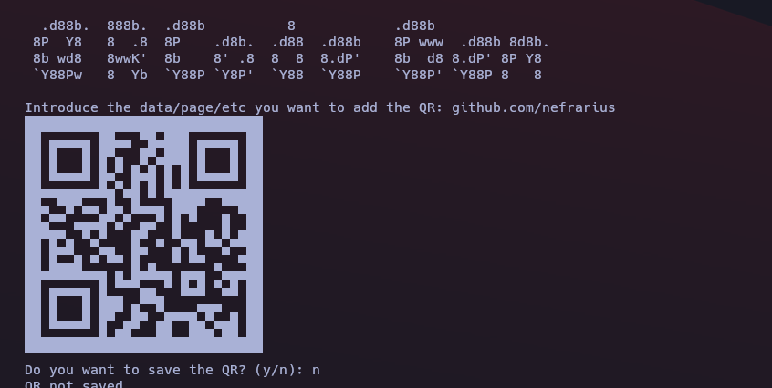

# 🎨 QR Code Generator  
A simple and customizable Python-based QR code generator that transforms your input (text, URLs, etc.) into scannable QR codes in image format. Perfect for sharing links, creating virtual business cards, or embedding data in a stylish and functional way!
<p align="center">
  
  
  
</p>
---

## 🌟 Features  
- **Simple Input**: Generate QR codes from any text or URL.  
- **Customizable**: Adjust the size, colors, and error correction levels.  
- **Save as Image**: Export your QR code as a PNG for easy sharing.  

---

## 🚀 How It Works  
1. Input your desired text or URL into the program.  
2. The script generates a QR code.  
3. Save the QR code as an image file and use it anywhere!  

---

## 🛠️ Installation  
### Requirements  
Ensure you have Python 3 installed and the following libraries:  
```
pip install qrcode
pip install qrcodeT
```  

Or simply just do

```
pip install -r requirements.txt
```

### Clone the Repository  
```
git clone https://github.com/yourusername/QRCodeGen.git  
cd QRCodeGen  
```  

---

## 📄 Usage  
Run the script and follow the prompts:  
```
python qr_generator.py
```  

### Example Output  
Input: `github.com/nefrarius`  
  

---

## 🎨 Customization Options  
You can easily tweak the following:  
- **Color**: Change the foreground and background colors.  
- **Error Correction Levels**: Adjust the resilience of the QR code.  
- **Size**: Modify the dimensions of the generated code.  

---

## 💡 Future Enhancements  
- Add a GUI for user-friendly interaction.  
- Integrate logo embedding inside QR codes.  
- Add batch QR code generation from a file input.  

---

## 📜 License  
This project is licensed under the MIT License.  

---

<div align="center">
    <h3>Made with ❤️ and Python 🐍</h3>
</div>
